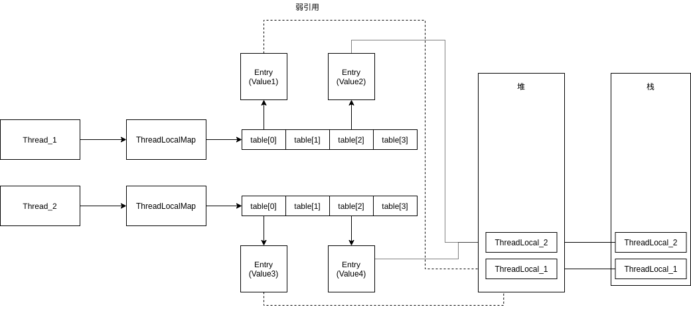

通过源码可知，ThreadLocalMap内部解决冲突的方法是线性探测法。
### Example解析
  
每个线程都拥有独立的ThreadLocalMap。当调用ThreadLocal.set(value1)时，
该线程对ThreadLocal对象进行哈希，然后放到ThreadLocalMap下的table中。
### 关于ThreadLocalMap.Entry继承了弱引用
在local2()方法中有对ThreadLocal的强引用，而Entry则保留对其的弱引用。
当离开local2()方法时，强引用消息，弱引用在GC后也跟着失效。
不过这个时候Entry[] table中的value还在（**你可以认为这是发生了内存泄露**）。
> 如果你想回收这个value，在方法退出前执行remove即可

在下次，该线程设置新的ThreadLocal时，通过哈希找到table[n],此时table[n]的位置可能还有发生泄露的value，
它会先调用table[n].get()，如果为null，即对应ThreadLocal已被回收，说明这个value已经失效，可以把新的值写在这里。
### 参考资料
https://baijiahao.baidu.com/s?id=1653790035315010634&wfr=spider&for=pc
